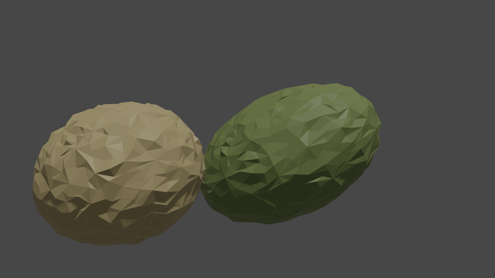
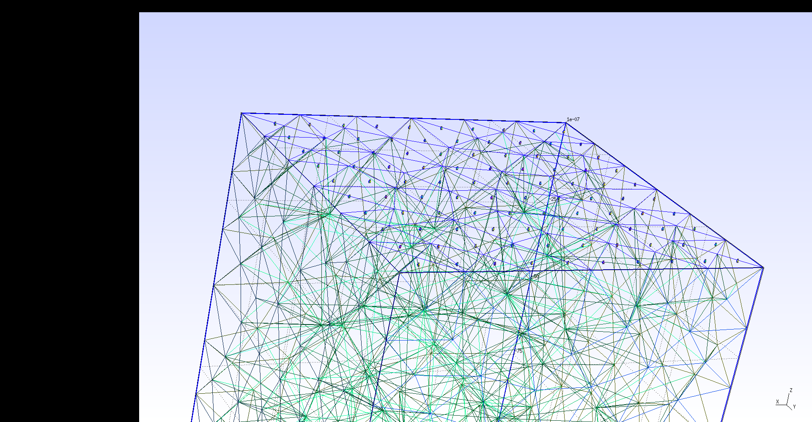
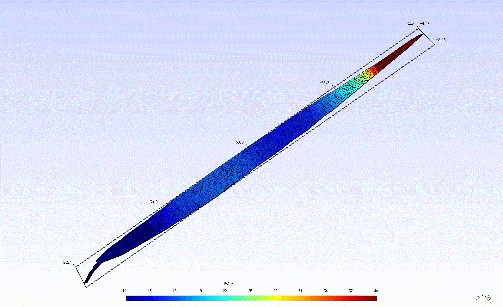

# SiCroF

Simulator for Crops in Fields

## Documentation of SiCroF

[使い方：日本語版 >> ](https://qiita.com/soybean) https://qiita.com/soybean

## Environment

### Linux 

#### Ubuntu 18.04

```
sudo apt update
sudo apt upgrade -y
sudo apt install git
git clone https://gitlab.com/kazulagi/SiCroF.git
cd SiCroF
sudo apt install python3
python3 setup.py
jupyter-notebook
```

#### CentOS

```
sudo yum update
sudo yum upgrade -y
sudo yum install git
git clone https://gitlab.com/kazulagi/SiCroF.git
cd SiCroF
sudo yum install python3
sh ./setup_CentOS
jupyter-notebook
```

- Execute Gmsh and go to Tools>Mesh>General and check "Recombine all triangular meshes", then, click File>Save Option As Default  and close window.

### macOS (Mojave)


Install homebrew (https://brew.sh/index)

```
/usr/bin/ruby -e "$(curl -fsSL https://raw.githubusercontent.com/Homebrew/install/master/install)"

```

And, install other applications.


```
brew install git
git clone https://gitlab.com/kazulagi/SiCroF.git
cd SiCroF
brew install python3
python3 setup.py
jupyter-notebook
```

### Windows (10.0)

Please activate Windows Subsystem for Linux (WSL) and install Ubuntu 18.04 according to the article.
(Windows Windows Subsystem for Linux (WSL) を有効にしてください。 )
https://qiita.com/Aruneko/items/c79810b0b015bebf30bb

Install following applications 
（その後、以下のアプリケーションをインストールします。）
- Gmsh (http://gmsh.info/)
- Git (https://git-scm.com/)
- Python3 (https://www.python.org/)
- pip (https://qiita.com/suzuki_y/items/3261ffa9b67410803443)
- gfortran (https://home.hiroshima-u.ac.jp/rgdlab/rgdl_html/programming/gfortran_20180520.htm)
- jupyter notebook (https://jupyter.org/)

by following commands
（インストールは、以下のコマンドを打つことで可能です。）

```
sudo apt update
sudo apt upgrade -y
sudo apt install git
git clone https://gitlab.com/kazulagi/SiCroF.git
cd SiCroF
sudo apt install python3
python3 setup.py
jupyter-notebook
```

（以上で、SiCroFのインストールに向けた環境構築が完了しました。）

## Execute SiCroF

SiCroF can be utilized by using;

- Jupyter-notebook

```
cd ~/SiCroF
jupyter-notebook
```

- Fortran 


```
cd ~/SiCroF
python3 SiCroF.py
```

- Python

```
cd ~/SiCroF
python NAME_OF_YOUR_SCRIPT.py
```


```NAME_OF_YOUR_SCRIPT.py

import os
import sys
sys.path.append(./src/PySiCroFClass/SiCroF)

# Please write your program in here

```


## Photography

Ex.1 :: 3-D Finite Element model of soybean seed.

```command

python3 SiCroF.py

>>> install

>>> ./Tutorial/CreateSoybean/soybean.f90

```



Ex.2 :: 3-D Finite Element model of soybean seed sowed in a field.

```command

python3 SiCroF.py

>>> install

>>> ./Tutorial/CreateSoybean/SoybeanField.f90

```



Ex.3 :: 3-D thermal diffusion simulation of a grass leaf.

```zsh

jupyter-notebook 


```



## import file format   
- [Format of .scf file](doc/InputFileFormat.md)


## Documentations
* [Index](doc/index)   

* [ArrayOperationClass](doc/ArrayOperationClass.md)     

* [BoundaryConditionClass](doc/BoundaryConditionClass.md)       

* [ConstitutiveModelClass](doc/ConstitutiveModelClass.md)       

* [ContactMechanicsClass](doc/ContactMechanicsClass.md)        

* [ControlParameterClass](doc/ControlParameterClass.md)        

* [DiffusionEquationClass](doc/DiffusionEquationClass.md)       

* [FEMDomainClass](doc/FEMDomainClass.md)               

* [FEMIfaceClass](doc/FEMIfaceClass.md)                

* [FieldClass](doc/FieldClass.md)                   

* [FiniteDeformationClass](doc/FiniteDeformationClass.md)      

* [LinearSolverClass](doc/LinearSolverClass.md)            

* [MPIClass](doc/MPIClass.md)                     

* [MainClass](doc/MainClass.md)                    

* [MaterialPropClass](doc/MaterialPropClass.md)            

* [MathClass](doc/MathClass.md)                    

* [MeshOperationClass](doc/MeshOperationClass.md)           

* [MultiDiffDeformClass](doc/MultiDiffDeformClass.md)         

* [MultiPhysicsClass](doc/MultiPhysicsClass.md)            

* [OpenMPClass](doc/OpenMPClass.md)                  

* [PostProcessingClass](doc/PostProcessingClass.md)          

* [ShapeFunctionClass](doc/ShapeFunctionClass.md)           

* [SimulatorClass](doc/SimulatorClass.md)               

* [TermClass](doc/TermClass)                    


### logs;

- 2019/01/19 :: This Document is written.
- 2019/01/20 :: ControlParameterClass is included
- 2019/01/21 :: Bug Fixed :: FEMDomainClass/ExportFEMDomain.f90 about Neumann-Boundary
- 2019/01/21 :: "Method:DeallocateAll"::Deallocate all alleles.(For all objects)
- 2019/01/25 :: DisplayMesh.f90/ Implement >> Export Mesh data.
- 2019/02/19 :: DiffusionEquationClass.f90 >> Solver for diffusion equations with time-integration by Clank-Nicolson Method
- 2019/03/03 :: FiniteDeformationClass.f90 >> Solver for Finite Deformation problems (2D and 3D). 
- 2019/03/10 :: FEMIfaceClass.f90 >> Interface objects (3D).
- 2019/03/10 :: MeshOperationClass.f90 >> Mesh can be devided and interface mesh ca be generated (3D).
- 2019/03/21 :: install.sh and run.sh is created.
- 2019/03/23 :: Standarize FEMDomain(.scf) objects
- 2019/03/24 :: Field class and Simulator Class are created.
- 2019/03/26 :: Interface Solvers are created as MultiPhysics
- 2019/04/13 :: PreprocessingClass is created.
- 2019/04/13 :: DictionaryClass is created.
- 2019/05/13 :: PreProcessingClass is created.
- 2019/06/29 :: ContactMechanicsClass is under debug
- 2019/08/01 :: Jupyter notebook is introduced as GUI.  
- 2019/08/01 :: Installer for Windows/macOS/Linux is created. 
- 2019/08/03 :: Delauney triangulation is now under development.
- 2019/09/06 :: Bugfix of Simulatior
- 2019/09/23 :: Source code is opened.Now solvers for diffusion, finite deformation, and diffusion-deformation coupling are available. Contact solver is under debugging.

### On going;
- ContactMechanicsClass is created for 3-D, Frictionless contact.
- automatic documentation program ./doc/upgrade_readme.py
- Finite-elasto-plasticity for 3D problems is being implemented.


### Requests;
- For all objects 1/21 :: Rule.Style >> Class Name = {objectname_} + "Class"
- For all objects 1/21 :: "Class::EditorClass" >> Edit and modify InputObjects
- For .bat files 2019/3/4 :: Adopt Windows
- For Diff and Deformation :: generate restartfiles
- For Shape Function 2019/3/10 :: Enable Triangular elements. 
- Confirm that the FEMIfaceClass.f90 can work under 2D confition.
- Developing Contact Mechanics Class.
- Developing All shape-functions for the preparation of space-time class
- Add-on for Blender
- Bugfix for preprocessingclass & PySiCroF
- Use opencv-python as a imaging library instead of PIL.


### Questions & Answers;

- Does it allow interactions between two domains without using interface? : No.
- Can interfaces take the forms of 1-D, 2-D and 3-D? : Yes.
- Does interface include not only surface-to-surface but also domain-to-domain (element-to-element)? : Yes.
- When the interfaces are to be generated? : Anytime.
- Can we use multiple types of elements in a mesh? : No, we cannot. 
- Can we use multiple types of Strain Theory in a mesh? : No, we cannot. 
- Can we use multiple types of Constitutive Models in a mesh? :  No, we cannot, however, it will be revised.

### Calling for someone who can create following modules.

- SiCroF-API for Blender >> We would like to use Blender as a GUI. Author tried to create the API (see src/BlenderClass), however, it will take more time to understand and implement the system Blender 28.0-API and the SiCroF-API for Blender is now stopping.
- Fluid solvers (by using src/FEMDomainClass)
- Functional-structural model for cereals.(like src/LsystemClass)
